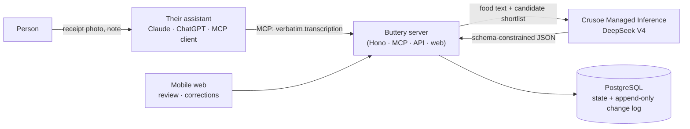

# Buttery

**An agent-first household food ledger.** People manage their food by talking to the AI assistant
they already use (Claude, ChatGPT/Codex, any MCP client). They share a Costco receipt, a fridge
photo or a recipe screenshot, or just say "I froze the chicken". Buttery keeps a trustworthy record
of what food the household has, what evidence supports each belief, and what is about to expire.
A small mobile web app handles quick reviews and corrections through links the assistant hands
you.

It's calm, competent record-keeping, not a diet tracker. It is honest about uncertainty: "about
half a jug, estimated from a photo 3 days ago".

## How it works



1. **Perception stays with the assistant.** It reads the photo and sends a structured
   transcription through MCP (`submit_observation`).
2. **Reasoning runs on Crusoe.** The server's reasoning module canonicalizes each line (name,
   category, package size, coupon/return/non-food) and matches it to the household's existing
   foods. It also estimates shelf life, parses free-text notes and ranks recipes.
3. **Nothing is committed blindly.** Model output becomes *proposals* with confidence and
   provenance. Receipts are review-all: the person approves them on the phone-friendly review page
   (or through `resolve_proposal`). Every change is append-only and can be undone.
4. **Any new conversation can recover the state** with `get_household_summary`,
   `search_inventory` and `get_item`.

## Stack

### Sponsor tools

| Sponsor | What it does in Buttery | Status |
|---|---|---|
| **Crusoe** (Managed Inference) | The reasoning engine behind every judgment the server makes about food. Canonicalization (the priority), shelf life, activity parsing and recipe ranking run on `deepseek-ai/Deepseek-V4-Flash` (with V4 Pro for parsing), constrained by schemas, deterministic unit and naming standards, guardrails and an offline fallback. See [`docs/crusoe.md`](docs/crusoe.md). | Live; integrated in the server |
| **DuploCloud** (AI Studio DevKit) | The QA/operations agent. A Claude Code agent in the `buttery-qa` workspace runs tickets against Buttery over an authenticated MCP scope: identity, receipt import, apply, package check, duplicate protection and undo. See [`docs/duplocloud.md`](docs/duplocloud.md). | Ticket `butteryqa-1` passed all 7 checks (inventory 0 → 6 → 6 → 0) |
| **Vultr** (Cloud Compute) | Always-on public hosting for the API, MCP server and web app. Every merge to `main` is tested, built into one image, rehearsed, published to GHCR and promoted to the Vultr VM by digest. See [`docs/runbooks/deploy-vultr.md`](docs/runbooks/deploy-vultr.md). | Live at `https://140-82-48-162.sslip.io` |

### Application

| Layer | Technology |
|---|---|
| Runtime | Node 26, TypeScript 7 (strict), npm workspaces |
| Server | Hono 4 on `@hono/node-server`: MCP (Streamable HTTP, stateless) via `@modelcontextprotocol/sdk`, a JSON API, and the built web app, all from one service |
| Database | PostgreSQL 17 (Docker), Drizzle ORM + postgres.js. Current state plus an append-only change log written in one transaction |
| Reasoning | `packages/reasoning`: OpenAI-compatible client to Crusoe, Zod 4 schemas, guardrails, a synthetic eval |
| Domain rules | `packages/domain`: units, quantities, expiry math, name normalization and shortlisting, in plain testable code |
| Web | React 19, React Router 8, Vite 8: a mobile-first review, inventory and settings UI |
| Identity | WorkOS AuthKit (OAuth 2.1 for MCP connectors and web sign-in) plus personal access tokens (`btr_…`) for CLIs and agent workers |
| Networking | Production: Vultr VM, Caddy (automatic HTTPS) in front of the app. Development: Docker Compose (`app` + `db`) on the agentdock network, published through Tailscale Funnel |
| Delivery | GitHub Actions → GHCR (digest-pinned image) → Vultr over SSH |
| Tests | Vitest (unit and server), Playwright (phone-viewport end-to-end) |

## Repository layout

```
apps/server         Hono service: MCP tools, JSON API, auth, services, Drizzle schema and migrations
apps/web            React/Vite mobile web app (review, inventory, item, settings)
packages/domain     Pure rules: quantities and units, expiry, normalization, shortlists
packages/reasoning  Crusoe reasoning module, synthetic canonicalization eval, live demo
tests/e2e           Playwright end-to-end tests
tests/fixtures      Synthetic receipt, fridge, recipe and meal images, with expected data
docs/               Spec, plans, handoffs, runbooks, Crusoe and DuploCloud notes
docker/, Dockerfile, docker-compose.yml   Container build and local stack
```

## MCP tools

`whoami` · `submit_observation` · `resolve_proposal` · `undo` · `upsert_food` ·
`get_household_summary` · `search_inventory` · `get_item`

Every state-changing call takes an `idempotency_key`. Retries are safe, and a re-sent receipt is
detected as a duplicate instead of being counted twice.

## Getting started

Prerequisites: Node 26, Docker.

```sh
cp .env.example .env            # fill in SESSION_SECRET; CRUSOE_API_KEY for live reasoning
npm ci
npm run db:up                   # Postgres 17 on localhost:5433
npm run db:migrate
npm run dev                     # server on http://localhost:8790 (MCP at /mcp, health at /healthz)
npm run dev -w apps/web         # web app on http://localhost:5173 (proxies /api and /auth)
```

Create a token for an agent, then connect it. See
[`docs/runbooks/connect-clients.md`](docs/runbooks/connect-clients.md) for Claude, Claude Code,
Codex and agentdock workers.

```sh
npm run token:create -- --email you@example.com --client "Claude Code"
claude mcp add --transport http buttery http://localhost:8790/mcp --header "Authorization: Bearer <btr_ token>"
```

For the full container stack (the app serves the built web UI): `docker compose up -d --build`.

Without `CRUSOE_API_KEY`, reasoning runs on its deterministic offline fallback. That's useful for
tests, but naming and matching quality drop sharply.

## Testing

```sh
npm test                        # all workspaces (the server tests use TEST_DATABASE_URL)
npm run typecheck
npm run e2e                     # Playwright, phone viewport
```

Crusoe credits are reserved for the demo. Tests use the reasoning package's fake and fallback
providers and never call Crusoe; only `packages/reasoning`'s live smoke tests do, and only when
`CRUSOE_API_KEY` is set.

## Crusoe demo

```sh
npm run demo -w packages/reasoning -- --file scripts/demo-receipt.txt --compare
```

This runs a warehouse-club receipt through Crusoe and prints the canonical items, sizes in base
units, matches to a sample household, confidence, latency and cost (about $0.0006 per receipt),
next to the offline fallback for contrast.

Headline results from the synthetic eval (held-out test split, DeepSeek V4 Flash): **0.9% wrong
matches** (down from 2.8%), 98.9% match accuracy, 99.4% precision on high-confidence matches,
100% package sizes. Details are in [`packages/reasoning/README.md`](packages/reasoning/README.md).

## Deployment

**Continuous deployment:** `.github/workflows/demo.yml`. Pull requests to `main` run
typecheck, tests and the web build. A merge to `main` then:
1. builds one AMD64 image and checks it contains no local credentials;
2. rehearses it against a throwaway database;
3. publishes it to GHCR;
4. promotes that exact digest to Vultr over verified SSH, with a database backup before
   migrations;
5. runs read-only HTTPS smoke checks.

**Demo endpoint:** `https://140-82-48-162.sslip.io` (MCP at `/mcp`). It runs on a Vultr
`vc2-2c-4gb` VM in Silicon Valley (about $0.027/hr), with Caddy providing Let's Encrypt HTTPS in
front of the app on `127.0.0.1:8793`. The demo has its own database, household and tokens.

```sh
# on the VM, as the deploy user, to create a presenter token (sign-up is closed on the demo):
docker compose --project-name buttery-demo --env-file /opt/buttery/.env.demo -f /opt/buttery/deploy/demo/compose.yaml \
  exec app npm run token:create -- --email you@example.com --client "Claude Code"
claude mcp add --transport http buttery https://140-82-48-162.sslip.io/mcp --header "Authorization: Bearer <btr_ token>"
```

Host setup, GitHub configuration, rollback and teardown are in
[`docs/runbooks/deploy-vultr.md`](docs/runbooks/deploy-vultr.md). The Mac + Tailscale Funnel stack
(`docker-compose.yml`) remains the development environment.

## Documentation

- [`docs/superpowers/specs/2026-09-29-buttery-design.md`](docs/superpowers/specs/2026-09-29-buttery-design.md): product and system design
- [`docs/superpowers/plans/2026-09-29-buttery-phase0-1.md`](docs/superpowers/plans/2026-09-29-buttery-phase0-1.md): Phase 0–1 implementation plan
- [`docs/crusoe.md`](docs/crusoe.md): how and why Buttery uses Crusoe
- [`docs/handoffs/2026-09-29-reasoning-integration.md`](docs/handoffs/2026-09-29-reasoning-integration.md): integrating the reasoning module
- [`docs/duplocloud.md`](docs/duplocloud.md) and [`docs/duplocloud-local.md`](docs/duplocloud-local.md): the DuploCloud QA integration and local setup
- [`docs/demo-readiness.md`](docs/demo-readiness.md): demo readiness evidence and the five-minute demo
- [`docs/runbooks/connect-clients.md`](docs/runbooks/connect-clients.md): connecting assistants and agents
- [`docs/runbooks/deploy-vultr.md`](docs/runbooks/deploy-vultr.md): continuous deployment to Vultr
