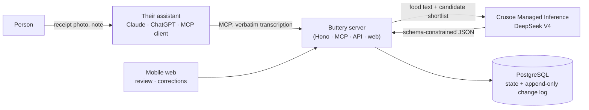

# Buttery

**An agent-first household food ledger.** People manage their food by talking to the AI assistant
they already use (Claude, ChatGPT/Codex, any MCP client). They share a Costco receipt, a fridge
photo or a recipe screenshot, or just say "I froze the chicken". Buttery keeps a trustworthy record
of what food the household has, what evidence supports each belief, and what is about to expire.
A small mobile web app handles quick reviews and corrections through links the assistant hands
you.

It's calm, competent record-keeping, not a diet tracker. It is honest about uncertainty: "about
half a jug, estimated from a photo 3 days ago".

**Status (Sep 29):** receipts work end to end, from a photo in Claude to reviewed, undoable
inventory, live at **https://140-82-48-162.sslip.io**. Fridge photos, recipes, shopping lists and
"what did I cook" are designed in the [spec](docs/superpowers/specs/2026-09-29-buttery-design.md)
and come next.

## Built on our sponsors

### Crusoe: the reasoning engine

Every judgment Buttery makes about food runs on open models served by **Crusoe Managed
Inference**. The connected assistant reads the photo; Crusoe decides what each line *is*.

- **Four server-side functions behind one trust boundary.** `canonicalizeItems` (name, category,
  package size, coupon/return/non-food, and the match to food you already have),
  `estimateShelfLife`, `parseActivity` and `rankRecipes`. Each is schema-constrained with guided
  JSON decoding, validated, repaired once if needed, and backed by a deterministic fallback, so
  the app keeps working if Crusoe is unreachable.
- **Models picked by live measurement.** DeepSeek V4 Flash for canonicalization, shelf life and
  ranking (about 0.3 s per receipt line); DeepSeek V4 Pro for free-text activity parsing.
- **Accuracy you can act on.** On the held-out synthetic eval: 98.9% match accuracy, 0.9% wrong
  matches, 100% package sizes and categories, and **99.4% precision on high-confidence matches**.
- **That confidence drives the product.** Each receipt gets a verdict built from Crusoe's per-line
  confidence plus server-side checks (duplicates, fallback use, returns). On `safe_to_apply` the
  agent asks "Add all 11?" and a one-word yes commits the receipt, with no review screen.
- **Provenance on every belief.** Every call is logged in `reasoning_calls` (model, path, latency,
  tokens, guardrail corrections) and linked from the proposal lines and shelf-life estimates it
  produced.
- **Cheap, and cheaper over time.** About $0.0006 per receipt. Confirmed receipt lines are learned
  as aliases, so the same line next time skips the model, and results are cached in Postgres.
- **Verified in production:** an authenticated receipt import on the Vultr demo made 7 Crusoe calls
  (DeepSeek V4 Flash), all valid, none falling back.

Deep dive: [`docs/crusoe.md`](docs/crusoe.md) and [`packages/reasoning/README.md`](packages/reasoning/README.md).

### Vultr: always-on hosting with continuous deployment

- The API, MCP server and web app run on a **Vultr Cloud Compute** VM (`vc2-2c-4gb`, Silicon
  Valley, about $0.027/hr) behind Caddy with Let's Encrypt HTTPS.
- **Every merge to `main` ships itself.** One AMD64 image is built, checked for leaked
  credentials, rehearsed against a throwaway database, published to GHCR and promoted to Vultr by
  digest. A database backup runs before migrations and HTTPS smoke checks run after.
- **Track record:** 5 successful production deploys on demo day, including the receipt verdict and
  the web redesign, plus 7 of 7 pull-request verification runs.

Details: [`docs/runbooks/deploy-vultr.md`](docs/runbooks/deploy-vultr.md).

### DuploCloud: the QA agent

- A Claude Code agent in **DuploCloud AI Studio** (`buttery-qa` workspace) drives Buttery over an
  authenticated MCP scope, the same way a user's assistant would.
- Ticket `butteryqa-1` passed all 7 checks: identity, receipt import, apply six items, package
  sizes, duplicate protection and undo (inventory 0 → 6 → 6 → 0).

Details: [`docs/duplocloud.md`](docs/duplocloud.md).

## How it works



1. **Perception stays with the assistant.** It reads the photo and sends a structured
   transcription through MCP (`submit_observation`).
2. **Reasoning runs on Crusoe.** The server's reasoning module canonicalizes each line (name,
   category, package size, coupon/return/non-food) and matches it to the household's existing
   foods. It also estimates shelf life, parses free-text notes and ranks recipes.
3. **Nothing is committed blindly.** Model output becomes *proposals* with confidence and
   provenance, and each receipt gets a verdict: `safe_to_apply` (a one-word yes in chat is
   enough), `quick_check` (the agent reads back the few lines worth a glance) or `needs_review`
   (the agent sends a review link, e.g. for a possible duplicate). Every change is append-only and
   can be undone.
4. **Any new conversation can recover the state** with `get_household_summary`,
   `search_inventory` and `get_item`.

## Stack

| Layer | Technology |
|---|---|
| Runtime | Node 26, TypeScript 7 (strict), npm workspaces |
| Server | Hono 4 on `@hono/node-server`: MCP (Streamable HTTP, stateless) via `@modelcontextprotocol/sdk`, a JSON API, and the built web app, all from one service |
| Database | PostgreSQL 17 (Docker), Drizzle ORM + postgres.js. Current state plus an append-only change log written in one transaction |
| Reasoning | `packages/reasoning`: OpenAI-compatible client to Crusoe, Zod 4 schemas, guardrails, a synthetic eval |
| Domain rules | `packages/domain`: units, quantities, expiry math, name normalization and shortlisting, in plain testable code |
| Web | React 19, React Router 8, Vite 8: a mobile-first review, inventory and settings UI |
| Identity | WorkOS AuthKit (OAuth 2.1 for MCP connectors and web sign-in) plus personal access tokens (`btr_…`) for CLIs and agent workers |
| Networking | Production: Vultr VM with Caddy (automatic HTTPS) in front of the app. Development: Docker Compose (`app` + `db`), optionally joined to the agentdock network for agent workers |
| Delivery | GitHub Actions → GHCR (digest-pinned image) → Vultr over SSH |
| Tests | Vitest (unit and server), Playwright (phone-viewport end-to-end) |

## Repository layout

```
apps/server         Hono service: MCP tools, JSON API, auth, services, Drizzle schema and migrations
apps/web            React/Vite mobile web app (review, inventory, item, settings)
packages/domain     Pure rules: quantities and units, expiry, normalization, shortlists
packages/reasoning  Crusoe reasoning module, synthetic canonicalization eval, live demo
tests/e2e           Playwright end-to-end tests
tests/fixtures      Synthetic receipt, fridge, recipe and meal images, with expected data
docs/               Spec, plans, handoffs, runbooks, Crusoe and DuploCloud notes
docker/, Dockerfile, docker-compose.yml   Container build and local stack
```

## MCP tools

`whoami` · `submit_observation` · `resolve_proposal` · `undo` · `upsert_food` ·
`get_household_summary` · `search_inventory` · `get_item` · `get_login_code`

`submit_observation` returns the receipt's verdict, the lines worth a glance and the next step for
the agent, so most receipts are confirmed in conversation rather than on a screen.

Every state-changing call takes an `idempotency_key`. Retries are safe, and a re-sent receipt is
detected as a duplicate instead of being counted twice.

`get_login_code` turns a review, item or inventory link into a one-tap link: the person taps
**Open** and sees that page for 24 hours without signing in. It doesn't sign the browser in or
reach any other page. Revoking the agent's token also revokes its links and the access they gave.

## Getting started

Prerequisites: Node 26, Docker.

```sh
cp .env.example .env            # fill in SESSION_SECRET; CRUSOE_API_KEY for live reasoning
npm ci
npm run db:up                   # Postgres 17 on localhost:5433
npm run db:migrate
npm run dev                     # server on http://localhost:8790 (MCP at /mcp, health at /healthz)
npm run dev -w apps/web         # web app on http://localhost:5173 (proxies /api and /auth)
```

Create a token for an agent, then connect it. See
[`docs/runbooks/connect-clients.md`](docs/runbooks/connect-clients.md) for Claude, Claude Code,
Codex and agentdock workers.

```sh
npm run token:create -- --email you@example.com --client "Claude Code"
claude mcp add --transport http buttery http://localhost:8790/mcp --header "Authorization: Bearer <btr_ token>"
```

For the full container stack (the app serves the built web UI): `docker compose up -d --build`.

Without `CRUSOE_API_KEY`, reasoning runs on its deterministic offline fallback. That's useful for
tests, but naming and matching quality drop sharply.

## Testing

```sh
npm test                        # 228 tests: domain 35, reasoning 94 (+2 live, skipped without a key), server 99
npm run typecheck
npm run e2e                     # 8 Playwright tests at a phone viewport
```

CI runs typecheck, tests and the web build on every pull request. Parallel worktrees can use
their own databases with `TEST_DATABASE_URL`, `E2E_PORT` and `E2E_DATABASE_URL`.

Crusoe credits are reserved for the demo. Tests use the reasoning package's fake and fallback
providers and never call Crusoe; only `packages/reasoning`'s live smoke tests do, and only when
`CRUSOE_API_KEY` is set.

## Crusoe demo

```sh
npm run demo -w packages/reasoning -- --file scripts/demo-receipt.txt --compare
```

This runs a warehouse-club receipt through Crusoe and prints the canonical items, sizes in base
units, matches to a sample household, confidence, latency and cost (about $0.0006 per receipt),
next to the offline fallback for contrast.

Headline results from the synthetic eval (held-out test split, DeepSeek V4 Flash): **0.9% wrong
matches** (down from 2.8%), 98.9% match accuracy, 99.4% precision on high-confidence matches,
100% package sizes. Details are in [`packages/reasoning/README.md`](packages/reasoning/README.md).

## Deployment

**Continuous deployment:** `.github/workflows/demo.yml`. Pull requests to `main` run
typecheck, tests and the web build. A merge to `main` then:
1. builds one AMD64 image and checks it contains no local credentials;
2. rehearses it against a throwaway database;
3. publishes it to GHCR;
4. promotes that exact digest to Vultr over verified SSH, with a database backup before
   migrations;
5. runs read-only HTTPS smoke checks.

**Demo endpoint:** `https://140-82-48-162.sslip.io` (MCP at `/mcp`). It runs on a Vultr
`vc2-2c-4gb` VM in Silicon Valley (about $0.027/hr), with Caddy providing Let's Encrypt HTTPS in
front of the app on `127.0.0.1:8793`. The demo has its own database, household and tokens.

**Claude chat (claude.ai, desktop, mobile):** Settings → Connectors → Add custom connector →
URL `https://140-82-48-162.sslip.io/mcp` → Connect → sign in with WorkOS AuthKit. Sign-up is open
on the demo; the first sign-in creates your account and household.

**Claude Code / CLIs** can use a personal access token instead:

```sh
ssh root@140.82.48.162 'docker exec buttery-demo-app-1 npm run -s token:create -- --email you@example.com --client "Claude Code"'
claude mcp add --transport http buttery https://140-82-48-162.sslip.io/mcp --header "Authorization: Bearer <btr_ token>"
```

Host setup, GitHub configuration, rollback and teardown are in
[`docs/runbooks/deploy-vultr.md`](docs/runbooks/deploy-vultr.md). `docker-compose.yml` is the local
development stack.

## Documentation

- [`docs/superpowers/specs/2026-09-29-buttery-design.md`](docs/superpowers/specs/2026-09-29-buttery-design.md): product and system design
- [`docs/superpowers/plans/2026-09-29-buttery-phase0-1.md`](docs/superpowers/plans/2026-09-29-buttery-phase0-1.md): Phase 0–1 implementation plan
- [`docs/crusoe.md`](docs/crusoe.md): how and why Buttery uses Crusoe
- [`docs/handoffs/2026-09-29-reasoning-integration.md`](docs/handoffs/2026-09-29-reasoning-integration.md): integrating the reasoning module
- [`docs/duplocloud.md`](docs/duplocloud.md) and [`docs/duplocloud-local.md`](docs/duplocloud-local.md): the DuploCloud QA integration and local setup
- [`docs/demo-readiness.md`](docs/demo-readiness.md): demo readiness evidence and the five-minute demo
- [`docs/runbooks/connect-clients.md`](docs/runbooks/connect-clients.md): connecting assistants and agents
- [`docs/runbooks/deploy-vultr.md`](docs/runbooks/deploy-vultr.md): continuous deployment to Vultr
