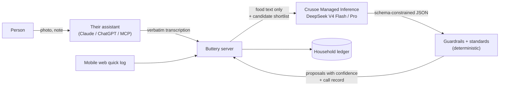

# Crusoe in Buttery

Buttery is an agent-first household food ledger. People talk to the assistant they already use
(Claude, ChatGPT, any MCP client): they share a receipt photo or say "I froze the chicken", and
Buttery keeps a trustworthy record of what food the household has and why it believes it.

**Crusoe Managed Inference is Buttery's reasoning engine.** Every judgment the server makes about
food runs on open models served by Crusoe, fenced in by schemas, deterministic standards and
fallbacks. That includes deciding what a receipt line is, whether it matches food you already
have, how long it keeps, and what a note like "used half the milk" means.

## Why a server-side model when the user already has an LLM?

The connected assistant handles perception and conversation. It reads the photo and transcribes
the receipt. Crusoe handles the household's judgment calls. Plain code handles the facts:
quantities, dates, undo. Crusoe earns its place for four reasons:

1. **Consistency across clients.** Claude, ChatGPT and a small MCP client would each name items,
   pick categories and estimate expiry differently. When every judgment runs on one server-side
   model with one prompt and one set of standards, `KS ORG CHKN THGH` becomes the same food with
   the same shelf life no matter who sent it. A record assembled from different agents' guesses
   isn't trustworthy; this one is.
2. **A trust boundary with provenance.** The server can't verify an agent's claim that milk lasts
   30 days. Crusoe output is bounded instead. It can only match a food from the server's shortlist
   (or say "new"), and shelf-life estimates are clamped to safety limits. Every call is logged with
   the model that produced it. That's how "what evidence supports this belief?" gets a real answer,
   e.g. *"expires Oct 4: opened 9/29 + 5 days, estimated by DeepSeek V4 Flash on Crusoe, medium
   confidence."*
3. **Surfaces with no LLM in the loop.** The mobile web quick log ("used half the milk") and
   future receipt forwarding have no assistant attached. Crusoe is what understands them.
4. **Cost that falls over time.** Results are cached, and receipt text is learned as an alias when
   a proposal is applied, so the same line next week skips the model entirely. The client agent
   would redo that work in every conversation.

## What Crusoe does

| Function | Input | Output | Why it matters |
|---|---|---|---|
| **`canonicalizeItems`** (the priority) | Receipt or typed item lines, plus a shortlist of the household's existing foods | Canonical name, category, package size, line kind (item / coupon / return / non-food), and a match to an existing food or "new", with confidence | Every other feature (expiry, recipes, shopping lists) is only as good as the item records. A wrong match silently corrupts inventory. |
| `estimateShelfLife` | Food, storage state, location | Days per state (sealed, opened, frozen…) with confidence, clamped to category safety bounds | Drives "what's about to expire", which is the core of reducing waste. |
| `parseActivity` | A household note plus current inventory | Structured events ("froze" on the chicken lot) and ambiguities | Lets people log by talking instead of tapping. |
| `rankRecipes` | Deterministically scored recipe candidates plus what's expiring | Re-ranked list, one-line explanations, optional new ideas | "Cook this tonight; it uses the spinach before it turns." |



## How we use it

- **API:** OpenAI-compatible chat completions at `https://api.inference.crusoecloud.com/v1`.
- **Models:** we measured the catalog live and picked by quality and latency:
  - `deepseek-ai/Deepseek-V4-Flash` for canonicalization, shelf life and ranking (about 0.3 s per
    receipt line, 100% on the fixture eval);
  - `deepseek-ai/DeepSeek-V4-Pro` for parsing notes, where picking the right lot drives auto-apply.
    It resolved lots correctly in live checks at about 1 s.
- **Guided decoding:** Crusoe serves every model with guided decoding, so the output schema is
  enforced while tokens are generated, not just checked afterwards. We use that as a first line of
  defense: categories, line kinds and units are enums the model literally cannot step outside.
- **Standards on top of the model.** Determinism isn't possible, so the model is fenced in by
  fixed conventions:
  - **Units:** package units come from a fixed list (`g, kg, oz, lb, ml, l, fl_oz, gal, qt, pt, ct`),
    and every package converts to grams, millilitres or a count, so "64 FL OZ" and "1/2 GAL"
    compare correctly.
  - **Sizes:** a size printed on the receipt always wins over the model's reading (`2.5#`, `52Z`,
    `HG`, `5 DZ` → 60 ct, `2/40OZ`).
  - **Names:** names are standardized (no brand, "organic" or size; variety kept: "2% milk").
  - **Line kinds:** explicit receipt markers (`INST SAV`, `RETURN`) decide coupons and returns.
- **Guardrails:**
  - one repair retry with the validation errors;
  - invented ids are rejected;
  - shelf-life estimates are clamped;
  - timeouts: 20 s for receipts, 8 s for the rest;
  - privacy: only food text leaves the server, with names, emails and addresses stripped;
  - a deterministic fallback, so the app works when Crusoe is unreachable.

## Evidence

We built a synthetic canonicalization benchmark locally, with no model calls, so every label is
correct by construction:
- about 110 foods in four store receipt styles;
- matching scenarios: the food exists, exists under a learned alias, only look-alikes exist, only
  unrelated foods exist, and no candidates;
- dev and held-out test splits, including hand-written hard cases.

Results on the held-out test split with DeepSeek V4 Flash on Crusoe:

| | Before tuning | After |
|---|---|---|
| **Wrong match** (attached to the wrong food) | 2.8% | **0.9%** |
| Match accuracy | 97.2% | **98.9%** |
| Precision of high-confidence matches | 97.7% | **99.4%** |
| Package size | 99.6% | **100%** |
| Category | 99.1% | **100%** |
| Latency per receipt | 5.4 s | **3.8 s** |

- **Auto-apply:** high-confidence matches are right 99%+ of the time, so they can be auto-applied
  while everything else stays a suggestion.
- **Versus no model:** on the same test split, the deterministic fallback gets 65% of names and
  63% of categories right, and finds only 37% of foods that already exist in the household.
  Crusoe is the difference between a demo and a usable product.
- **Cost:** about **$0.0006 per receipt**. The entire tuning effort, dozens of full benchmark runs
  and model comparisons, cost about **$0.20** in Crusoe credits.

## What we learned about Crusoe

These were found live and handled in code (details in `packages/reasoning/README.md`):

- **Model IDs:** use the IDs that `GET /v1/models` returns; some differ from the docs page
  (`zai-org/GLM-5.3`).
- **Keys:** inference needs an **Intelligence API key**. Cloud API keys are for infrastructure.
- **Guided-decoding quirks:**
  - A numeric lower bound (`exclusiveMinimum`) made "1/2 GAL" decode as `0`, so bounds are
    enforced after generation instead.
  - Properties are generated in schema order, so optional fields the model "passes" are lost. We
    build per-call schemas where it matters.
  - Optional fields tend to be filled rather than omitted, so a hygiene step drops empty values.
- **Latency:** about 0.3 s per line. Parallelizing one receipt across calls didn't speed it up, so
  it's one call per receipt.
- **Model fit:** Kimi K2.6 and Nemotron 3.5 Lightning exceeded our timeouts, while DeepSeek V4
  Flash and Pro were the best fit for low-latency structured extraction.

## Try it

```sh
npm run demo -w packages/reasoning -- --file scripts/demo-receipt.txt --compare
```

This runs a warehouse-club receipt through Crusoe and prints the canonical items, sizes
(converted to base units), matches to the household's foods, confidence, latency and cost. The
same lines run through the offline fallback alongside, for contrast.
