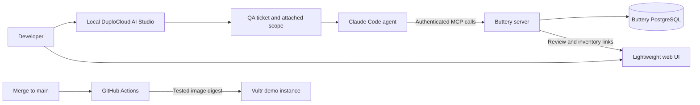

# DuploCloud integration

DuploCloud provides Buttery's local agent QA environment. Its AI Studio organizes a test run as a ticket, attaches a household-scoped Buttery MCP connection, and runs a Claude Code agent using the developer's subscription. The agent exercises the same MCP interface that a user-facing agent uses and records its findings in the ticket.

Buttery owns the food inventory, review proposals, and change history. DuploCloud holds the QA conversation and connection configuration. The separate Vultr demo is deployed through GitHub Actions on `main`; the current DuploCloud integration does not have deployment credentials.

This document describes the integration verified on **2026-09-29**. See [local setup and troubleshooting](duplocloud-local.md), [demo-readiness evidence](demo-readiness.md), and [Vultr deployment](runbooks/deploy-vultr.md) for operational details.

## Architecture



The agent's Claude subscription credential authenticates the local QA agent. A separate Buttery bearer token authenticates MCP calls to one synthetic household. Neither credential is a substitute for the other. Buttery's own configured reasoning provider is also separate from the QA agent's subscription.

The local DevKit runs under Docker Compose project `buttery-duplo`; Buttery's development app and the separate deployment rehearsal use their own projects and databases. Published DevKit ports are bound to localhost. The DevKit has no mount of the Buttery source repository or application `.env`.

## How the MCP connection is assembled

The configured objects are:

| Object | Name | Purpose |
| --- | --- | --- |
| Workspace | `buttery-qa` | Groups QA tickets and grants access to the local agent and scope |
| Agent | `local-agent` | Executes ticket work using the Claude Code subscription provider |
| MCP server | `buttery-local-demo` | Defines the HTTP connection to Buttery |
| Provider and credential | `buttery-demo-qa` | Stores the synthetic household's token as a sensitive credential field |
| Scope | `buttery-demo-qa` | Connects the credential and MCP server, and is attached to the workspace and ticket |
| Verified ticket | `butteryqa-1` | Contains the receipt-workflow QA results |

The MCP server uses a Raw configuration so DuploCloud can resolve a credential placeholder at runtime:

```json
{
  "mcpServers": {
    "buttery": {
      "type": "http",
      "url": "http://host.docker.internal:8790/mcp",
      "headers": {
        "Authorization": "Bearer ${credential.token}"
      }
    }
  }
}
```

`token` must match the credential field name exactly. The example contains a placeholder, not a usable credential. `host.docker.internal` reaches the app on the developer's Mac from inside the agent container; `localhost` inside that container would address the agent itself.

To reproduce the connection, register the MCP server, create the provider and its sensitive credential, create a scope linking them, attach the scope and agent to the workspace, and select the scope on the QA ticket. Registering an MCP server alone does not give a ticket access to it.

## What the QA agent does

The successful ticket used these checks, in order:

1. Call `whoami` and confirm the expected synthetic household before any mutation.
2. Call `get_household_summary` to record the inventory baseline.
3. Call `submit_observation` with the supplied structured receipt and an idempotency key.
4. Call `resolve_proposal` to accept and apply the receipt, retaining the returned change-set ID.
5. Read inventory and verify six added lots, including Greek yogurt represented as `2 × 32 oz`.
6. Submit the same receipt with a different idempotency key and verify `duplicate_of` is set and inventory does not increase.
7. Call `undo` for only the change set created by this ticket, then verify the baseline is restored.

Ticket `butteryqa-1` passed all seven checks: inventory progressed **0 → 6 → 6 → 0**. Undo retained the audit history and reopened the receipt proposal. The app reported no reasoning fallback during the import; canonicalization came from cache and shelf-life estimates came from model calls.

The ticket used supplied receipt transcription. It did not test image extraction or operate the web UI. Mobile review, correction, package preservation, and UI undo were checked separately. Fridge reconciliation, recipes, and shopping lists were not implemented MCP workflows at this verification point.

For another run, give the agent the expected household ID and exact fixture payload, require a PASS/FAIL/BLOCKED result with evidence for every step, and restrict mutations to that household and the change set it creates. If a required capability is unavailable, record the gap rather than treating it as a pass.

## Approvals and credentials

Per-call tool approvals stayed enabled for the verified run. A ticket prompt describes the authorized task; it does not replace the approval mechanism or expand the bearer token's household access.

There are three distinct authentication concerns:

- **AI Studio sign-in:** the developer's local account controls access to workspaces and tickets.
- **Claude Code subscription:** the agent uses the privately configured subscription token for inference.
- **Buttery MCP:** the attached scope supplies a dedicated synthetic household token to Buttery.

Local credentials and detailed run artifacts live under the Git-ignored `.local` directory. Release images exclude that directory and local environment/MCP configuration. Do not include it in a release bundle or upload it as a CI artifact.

When integrating through the installed Studio REST API, use `sendMessageStreaming`. This agent rejects plain `sendMessage`. The signed-in session must also provide the approval callback context. Live callback decisions and timed-out approval continuations have different payload shapes; the verified formats and troubleshooting steps are recorded in the [local runbook](duplocloud-local.md#running-another-check). Do not disable global approvals to work around a missing callback.

## Relationship to deployment

The prepared GitHub Actions workflow tests a `main` build, rehearses its image, publishes it to GHCR, promotes the exact digest to Vultr, and checks the public HTTPS endpoints. Its deployment scripts back up an existing demo database before migrations. The workflow needs the infrastructure configuration and merge described in the [deployment runbook](runbooks/deploy-vultr.md).

A future DuploCloud QA scope can target `https://<demo-domain>/mcp` with a token provisioned in the demo's own synthetic household. Keep it separate from `buttery-demo-qa`, which currently targets the local app. The local household token will not authenticate to a separate demo database.

Automatic post-deployment DuploCloud tickets are **not wired up yet**. The current deployment workflow performs read-only HTTP smoke checks; the authenticated receipt/duplicate/undo scenario was verified through the local ticket. Adding that scenario after deployment requires a demo-specific scope and an explicit ticket trigger with the same approval and household boundaries.

## Starting the local environment

From the repository root, after the DevKit has been installed and configured:

```sh
bash scripts/duplo-local.sh start
bash scripts/duplo-local.sh status
```

Open [local AI Studio](http://localhost:4210), sign in with the privately stored local credentials, and select `buttery-qa`. The [local runbook](duplocloud-local.md) covers authentication, service addresses, restarting, and the remaining optional DevKit features.
