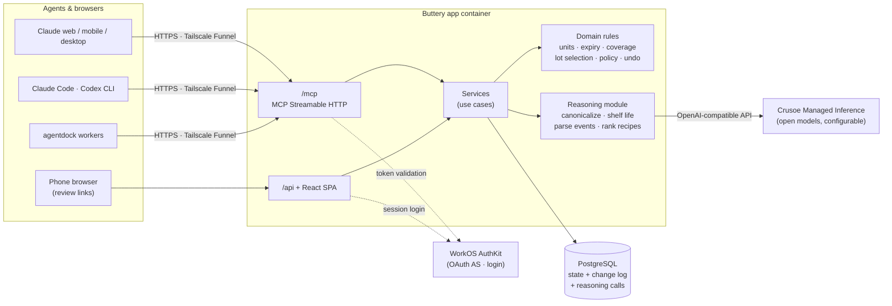

# Buttery — Design Spec

Date: 2026-09-29
Status: Draft for review

## 1. Product definition

Buttery is a **household food ledger that agents operate**. People use it mainly through
AI agents (Claude on web/mobile/desktop, Claude Code, Codex, agentdock workers, any MCP
client). The application owns the authoritative records and the rules: what the household
believes it has, the evidence behind each belief, what changed and who changed it.
The connected agent does perception (reading photos, receipts, screenshots) and
conversation. A server-side **reasoning module backed by Crusoe Managed Inference**
does the text reasoning that must be consistent regardless of which agent is connected:
canonicalizing item names, estimating shelf life with confidence, parsing free-text
events, and ranking what to cook. A small mobile web UI handles the things that are faster
by touch: reviewing proposals, correcting an item, following a recipe, checking off a list.

### Product principles

1. **Trustworthy beliefs over precise counts.** Quantities may be exact, approximate or
   unknown. Staples (salt, oil, flour…) are assumed present until marked out. The app
   surfaces stale beliefs instead of demanding constant confirmation.
2. **Evidence is not truth.** Observations (evidence), proposals (suggested changes) and
   changes (committed) are distinct records. A fridge photo never proves absence. A receipt
   proves a purchase, not what remains weeks later. A recipe ingredient never proves
   ownership.
3. **Perishability is first-class.** Every food is shelf-stable or perishable. Every
   expiry is either *printed* (recorded from packaging) or *estimated* (with its basis).
   "What should we use soon?" is a primary question, and recipe suggestions favor
   expiring items.
4. **Low-friction correction.** Every change is attributable and undoable. Retries and
   reprocessing never silently duplicate.
5. **Same rules everywhere.** MCP tools and the web UI call the same domain layer.

### MVP scope

**In:** inventory lots with provenance, uncertainty, perishability and printed/estimated
expiry; observation → proposal → change flow with undo and history; receipt
reconciliation; pantry/fridge photo proposals; direct activity logging (bought, cooked,
used, finished, discarded, froze, thawed, opened, moved); use-soon view; recipe capture,
editing and inventory-aware matching; shopping lists; compact state summary for fresh
agent conversations; four web views (review, inventory, recipe, shopping list);
household/member identity model; **self-serve sign-up and onboarding** (create an account and
household from the web, set household name/timezone, connect Claude via connector, mint and revoke
access tokens for CLI agents) with a `SIGNUP_MODE=open|closed` switch.

**Out (for now):** barcode scanning, nutrition/macros, meal-plan calendars, grocery-store
APIs and price tracking, server-side image interpretation (stretch goal, Section 11), native
apps, push notifications, sharing outside the household.

## 2. Key decisions

| Decision | Choice | Rationale / tradeoff |
|---|---|---|
| Perception (images) | **Connected agent.** It transcribes what it sees (receipt lines verbatim, visible items and levels, recipe text). Its interpretations are optional *hints*. | The user's image is already in the agent's context. MCP clients generally cannot forward image bytes to a tool. |
| Text reasoning | **Server-side reasoning module on Crusoe Managed Inference** (Section 6): canonicalize items and match them to inventory, estimate shelf life with confidence, parse free-text events, rank and explain recipes. Model configurable per function. | Consistent results no matter which agent or client is connected, and available to the web UI and thin clients. Crusoe is a clearly bounded component. Cost: latency, spend, and an external dependency, all mitigated by caching, deterministic fallbacks and batching. |
| Trust boundary for model output | Model output is **never committed directly**. It becomes proposal ops or *estimated* fields with confidence and a basis that names the model. The domain layer validates and clamps it, and the automation policy applies unchanged. | Keeps "evidence vs. belief" intact: an LLM guess is recorded as an estimate, never as a fact. |
| Deterministic core | Unit math, coverage, lot selection, idempotency, policy and undo stay in plain code. | Testable, and correct when Crusoe is unavailable. |
| Image bytes | Agents send structured transcriptions, which become the stored evidence. The original photo can optionally be attached from the review page (Phase 2). | See Perception. |
| Automation | **Server-enforced household policy** (Section 7). | Keeps MCP and web consistent; an agent cannot bypass review of photo inferences. |
| Duplicate protection | Idempotency keys + receipt fingerprints + optimistic item versions + shopping-completion reconciliation. | Agents don't reliably reuse keys on retry, so content-based dedup is also required. |
| Identity | Household = tenant; user = member; connection = OAuth client or personal access token tied to a user. Every change records actor user and client. MCP server is an **OAuth 2.1 resource server**; **WorkOS AuthKit** is the authorization server (supports Dynamic Client Registration for claude.ai connectors). PATs for CLIs and agentdock workers. | Multi-member households need no migration later. Avoids writing a custom authorization server. Alternative (embedded AS) rejected for security surface. |
| Web access | AuthKit login session as a long-lived cookie. Agents return plain deep links. | Links in chat history grant nothing by themselves. Object-scoped no-login links can be added later if phone login proves annoying. |
| Storage | **PostgreSQL 17** in a container. | Transactions spanning state + change log; unique constraints for idempotency/fingerprints; `SELECT … FOR UPDATE`; joins for coverage; `jsonb` for observation payloads. Row-level security available later for tenant isolation. |
| State model | Current-state tables + append-only change log written in the same transaction. Undo = compensating change set. | Full event sourcing rejected: rebuild/projection machinery without MVP benefit. |
| Hosting | Docker Compose (`app` + `postgres`) on this Mac, joined to the agentdock Docker network; public HTTPS via **Tailscale Funnel**. **Nice-to-have:** the same Compose stack on a Crusoe Cloud VM. | Phone access from day one at zero cost. Risk: unavailable when the Mac sleeps. Moving to a Crusoe Cloud VM fixes that and keeps the whole stack on the sponsor's platform. |

## 3. Architecture

Model output from the reasoning module passes back through the services layer, which validates it with domain rules
before it can become a proposal op or an estimated field. The reasoning module never
writes to the database directly, apart from logging its own calls.

Monorepo (npm workspaces, TypeScript, Node 26):

- **`packages/domain`** — Zod schemas and pure domain rules: quantity/unit math, expiry
  estimation, matching, coverage, policy evaluation, attention computation. Shared by the
  server and the web app (schemas for form validation).
- **`packages/reasoning`** — the Crusoe-backed reasoning module (Section 6). It exposes four
  typed functions behind a `ReasoningProvider` interface. Implementations: `crusoe`
  (OpenAI-compatible client), `fallback` (deterministic heuristics), `fake` (tests).
- **`apps/server`** — Hono on Node.
  - `/mcp` — MCP Streamable HTTP (`@modelcontextprotocol/sdk`), bearer-token protected;
    `/.well-known/oauth-protected-resource` metadata pointing at AuthKit.
  - `/api/*` — JSON API for the SPA; session-cookie protected.
  - `/auth/*` — AuthKit login/callback/logout.
  - Static SPA with client-route fallback for deep links.
  - Services layer (application use cases) calls domain rules and repositories; both MCP
    tools and API handlers are thin adapters over the same services.
  - Drizzle ORM + SQL migrations.
- **`apps/web`** — React + Vite SPA, mobile-first. Routes: `/review/:proposalId`,
  `/inventory` (with `?view=use-soon&location=…` etc.), `/items/:lotId`,
  `/recipes/:recipeId`, `/lists/:listId`, `/settings` (tokens, preferences; minimal).
- **Tests** — Vitest for domain (pure) and services (against a real Postgres test
  database); MCP contract tests using the SDK client against the running server;
  Playwright for web views at a phone viewport.

Configuration via environment: `DATABASE_URL`, `PUBLIC_BASE_URL` (used for all links),
AuthKit client id/secret/domain, session secret, `REASONING_PROVIDER` (`crusoe|fallback`),
`CRUSOE_API_KEY`, `CRUSOE_BASE_URL`, `REASONING_MODEL` (default) and optional per-function
overrides (`REASONING_MODEL_CANONICALIZE`, `_SHELF_LIFE`, `_PARSE`, `_RANK`).

## 4. Domain model

All tables carry `household_id`; all queries are household-scoped in the services layer.

### Identity

- `households(id, name, created_at)`
- `users(id, auth_subject, email, display_name)`
- `memberships(household_id, user_id, role: owner|member)`
- `connections(id, user_id, household_id, kind: oauth_client|pat, client_name, token_hash?, last_used_at, revoked_at)`
  — PATs are random tokens prefixed `btr_`, stored hashed.

First AuthKit login creates the user and a household where they are owner.
A user with several households has a default household; tools accept an optional
`household_id`.

### Catalog: `foods`

- `name`, `aliases[]` (normalized; receipt text such as `KS ORG EGGS 24CT` is learned as an alias on apply)
- `category` (e.g. dairy, eggs, poultry, leafy produce, condiment…)
- `perishability: shelf_stable | perishable`
- `shelf_life_days: {sealed?, opened?, frozen?, thawed?, prepared?}` each with
  `{days, confidence: high|medium|low, source: default_rule | model_estimate | agent_hint | user, reasoning_call_id?}`
- `default_location`, `default_package {count?, size?, unit?}`
- `is_staple` (assumed present unless marked out)
- `density_g_per_ml?` (enables volume↔mass conversion)

A built-in table provides category defaults (≈20 categories) for shelf life and
perishability, including **safety bounds** (a maximum number of days per category and state).
When a food is created, the reasoning module estimates shelf life per state
(`source: model_estimate`, clamped to the bounds). Estimates are cached on the food, so the
model is not called per lot. User-entered values always win.

### Inventory: `lots`

One row per purchase or batch; multiple lots of one food are normal.

- `food_id`, `location` (household-defined; defaults fridge, freezer, pantry, counter)
- `state: sealed | opened | frozen | thawed | prepared` (prepared = leftovers)
- `quantity: {kind: exact|approx|unknown, amount?, unit?}` and optional
  `package {count, size, unit}` so "half of a 1-gal jug" is expressible
- `expires: {on, kind: printed|estimated, confidence: high|medium|low, basis}`; `printed_expiry_on?`
  retained separately. Printed dates are `high` confidence. An estimate inherits the confidence
  of the shelf-life value it came from.
- `acquired_at`, `opened_at?`, `frozen_at?`, `thawed_at?`
- `last_evidence_at`, `last_evidence_observation_id`
- `status: active | depleted | discarded`
- `version` (incremented on every change)
- `notes`

**Effective expiry rule:**
- Sealed with a printed date → printed.
- Otherwise estimated: anchor + `shelf_life_days[state]`, where anchor is `acquired_at`
  (sealed), `opened_at` (opened), `frozen_at` (frozen), `thawed_at` (thawed), or the cook
  time (prepared). The basis string records the computation, e.g.
  `"opened 9/27 + 5d (model_estimate, crusoe:<model>, medium)"`.
- Shelf-stable foods with no printed date have no expiry. Opening a shelf-stable food with
  an `opened` shelf life makes the lot perishable from that point (e.g. pasta sauce).
- Freezing keeps `printed_expiry_on` but switches the effective expiry to the frozen estimate.

**Staleness:** a perishable active lot with no evidence for `stale_after_days`
(preference; default 7) is flagged for verification. Shelf-stable lots are never stale by time alone.

### Evidence: `observations`

- `kind: receipt | pantry_photo | meal_photo | recipe_capture | user_statement | shopping_completion | web_correction`
- `observed_at` (when it was true), `recorded_at`, `actor_user_id`, `connection_id`
- `payload jsonb` validated per kind. Receipt payload: `store, purchased_at, receipt_number?, total_cents?, lines[{raw_text, quantity?, unit_price_cents?, price_cents?, line_kind?: item|coupon|return|non_food, hint?{food_name?, package?, location_guess?}}]`.
  The agent's verbatim transcription is the evidence; `hint` is optional and is passed to canonicalization as context only.
- `fingerprint?` — receipts: hash of normalized store + purchased_at (to the minute) +
  total_cents + receipt_number if present; unique per household
- `attachment_id?`, `status: open | resolved`

### Proposed changes: `proposals`, `proposal_ops`

- `proposals(id, observation_id, status: pending|partial|applied|rejected|superseded, created_at)`
- `proposal_ops(id, proposal_id, seq, op, target_lot_id?, target_food_id?, payload jsonb, confidence: high|medium|low, rationale, candidates jsonb, based_on_version?, decision: pending|accepted|edited|rejected|conflict, result_change_set_id?)`
- Op types: `add_lot`, `create_food`, `add_alias`, `adjust_quantity`, `consume`,
  `discard`, `move`, `open`, `freeze`, `thaw`, `set_expiry`, `confirm_present`,
  `flag_not_seen`, `confirm_purchase`, `ignore_line`.

### Committed changes: `changes`

Append-only.
- `id, change_set_id, household_id, op, lot_id?, food_id?, before jsonb, after jsonb, cause_observation_id?, cause_proposal_op_id?, actor_user_id, connection_id, idempotency_key?, created_at, reverted_by_change_set_id?`
- **Undo:** a change set can be reverted if every affected lot's current `version` equals
  its `after` version; the revert is a new change set of compensating changes. Otherwise
  undo is refused with the conflicting lots listed.

### Recipes: `recipes`, `recipe_revisions`

- `title, source {kind: url|screenshot|book|generated|user, ref?, captured_at}, servings, time_active_min?, time_total_min?, effort: easy|medium|involved?, diet_tags[], notes`
- `ingredients[{id, raw_text, food_id?, amount?, unit?, optional, group?, origin, substitutions[{food_id?, text, note?, origin}]}]`
- `steps[{text, origin}]`
- `origin` per field/item: `extracted | generated | user_edited`
- Every update writes a `recipe_revisions` row (full snapshot, actor, timestamp).

### Shopping: `shopping_lists`, `list_items`

- `shopping_lists(id, name, status: active|archived)`
- `list_items(id, list_id, food_id?, text, quantity?, unit?, reasons jsonb [{recipe_id?, need_text}], priority: essential|optional|check_first, status: needed|got|removed, updated_by, updated_at)`
- **`got` means "in the cart / acquired for this list" and never changes inventory.**
  Inventory changes only through `complete_shopping` or a receipt.

### Reasoning provenance: `reasoning_calls`

`(id, household_id, function, provider, model, input_hash, input jsonb, output jsonb, valid, latency_ms, tokens_in, tokens_out, error?, created_at)`.
Proposal ops, food shelf-life values and parsed activities reference `reasoning_call_id`.
This lets "what evidence supports this belief?" show exactly which model produced which estimate.
`(function, model, input_hash)` also works as a cache.

### Idempotency: `idempotency_records`

`(household_id, tool, key)` unique; stores the request hash and response. Same key with the
same request → stored response. Same key with a different request → error
`idempotency_key_reused`.

### Attention (computed, not stored)

Pending/partial proposals; expired and expiring-soon lots; stale perishables; unknown
quantities needed by a list or recipe in progress; unmatched or ignored receipt lines
awaiting a decision; undo/version conflicts; `flag_not_seen` signals.

### Units and coverage

- Quantities are normalized to mass (g), volume (ml) or count. Conversion only within a
  dimension, or across mass/volume when the food has `density_g_per_ml`.
- Package-based quantities convert via package size when known.
- Coverage per ingredient: `covered | partial | missing | uncertain | staple_assumed`.
  Incompatible or unknown quantities yield `uncertain`, never a guess.

### Lot selection rule (used everywhere consumption happens)

When an activity names a food with several active lots: prefer the lot with the earliest
effective expiry, then the earliest `acquired_at`. The chosen lot and the assumption are
reported in the response.

## 5. MCP interface

The server's MCP `instructions` explain the operating model to every client: start with
`get_household_summary`; never infer absence from a photo; transcribe images verbatim and
let the server canonicalize; use `log_activity` when you can structure a clear statement
yourself and `log_text` to pass the user's words through unchanged; use `submit_observation` for images; always give the
user the returned review link; report lot-selection assumptions and offer undo.

### Response conventions

- Compact by default; `detail: true` expands.
- Quantities returned both structured and as readable text (`"~½ gal (photo, 9/27)"`).
- Every result includes `links` (absolute URLs under `PUBLIC_BASE_URL`), `uncertainties`,
  and `next` hints.
- Every state-changing tool requires `idempotency_key`.

### Tools (22)

**Identity**
- `whoami` — user, household(s), connection, preferences digest.

**State**
- `get_household_summary` — counts by location; top use-soon items (with printed/estimated
  flag); attention counts with links; pending reviews; active shopping list; last 5 change
  sets; preferences. Target ≤ ~2k tokens.
- `search_inventory(query?, location?, perishability?, expiring_within_days?, needs_attention?, include_depleted?, sort: expiry|location|recent)`
- `get_item(lot_id | food_id)` — detail, evidence trail, change history.
- `get_attention(kind?)` — grouped attention items with links.
- `get_changes(since?, lot_id?, change_set_id?, limit?)`

**Observations and changes**
- `submit_observation(kind, observed_at, payload, location?, idempotency_key)` → `{observation, proposal, duplicate_of?, review_url, auto_applied[]}`
- `log_activity(kind: bought|cooked|used|finished|discarded|froze|thawed|opened|moved, items[{food|lot_id, quantity?, to_location?}], recipe_id?, servings?, leftovers?, note?, idempotency_key)`
  → applied change set + undo handle + assumptions; unresolved parts go to attention.
- `log_text(text, idempotency_key)` — free-text events ("we used half the milk, froze the
  chicken"). Parsed by the reasoning module (`parseActivity`) into the same `log_activity`
  structures and stored as a `user_statement` observation with the verbatim text.
  High-confidence parsed activities are applied under the same policy as `log_activity`. Low-confidence or
  ambiguous ones become a proposal with a review link. The web inventory view has the same "quick log" box.
- `resolve_proposal(proposal_id, decisions[{op_id, accept|reject|edit, edits?}]?, apply: bool, idempotency_key)`
- `correct_item(lot_id, fields, reason, idempotency_key)`
- `undo(change_set_id, idempotency_key)`
- `upsert_food(food, idempotency_key)` — aliases, perishability, shelf life, staple flag, density.

**Recipes**
- `save_recipe(recipe, source, idempotency_key)` → id + link
- `update_recipe(recipe_id, patch, idempotency_key)` → new revision
- `get_recipe(recipe_id, servings?)` → scaled recipe + coverage + link
- `find_recipes(query?, max_total_min?, effort?, diet_tags?, prioritize_expiring=true, include_ideas=false, limit?)`
  → ranked saved recipes with coverage, which expiring lots each would use, and a short
  explanation per recipe. With `include_ideas`, also returns unsaved recipe ideas generated
  by the reasoning module (labeled `generated`, `generator: crusoe:<model>`).

**Shopping**
- `build_shopping_list(recipes[{recipe_id, servings}], list_id?, include_optional=false, idempotency_key)`
- `get_shopping_list(list_id?)` (default: active list)
- `update_shopping_list(list_id, ops[{add|remove|set_status|edit}], idempotency_key)`
- `complete_shopping(list_id, idempotency_key)` → `shopping_completion` observation → approximate purchase lots

**Preferences**
- `set_preferences(patch, idempotency_key)`

### Recipe ranking

Two stages:
1. **Deterministic score** (domain): coverage (fraction of essential ingredients
   `covered`/`staple_assumed`, partial counts half) + expiring bonus (weighted by urgency of
   lots used) − penalty for `missing` essentials; filtered by time/effort/diet. This alone
   produces a correct ranking.
2. **Reasoning re-rank** (`rankRecipes`): the top ~15 candidates plus the use-soon lots go to
   the model. It may reorder within the list, writes one-line explanations, and optionally
   proposes ideas. It cannot add saved recipes that weren't candidates or change coverage facts.

Saving a generated idea sets `source.kind = generated`, keeping `generator`.

## 6. Reasoning module (Crusoe Managed Inference)

A small internal module with four functions. Each has a Zod input and output schema, a prompt
template, a model setting, a deterministic fallback, and a logged call record.

| Function | Input | Output | Used by | Fallback |
|---|---|---|---|---|
| `canonicalizeItems` | Receipt/free-text lines (verbatim + optional agent hints) and, per line, a server-built **candidate shortlist** of existing foods and active lots (alias, name and trigram matches) | Per line: `canonical_name`, `category`, `perishability`, `package`, `line_kind`, `match: {food_id | "new", confidence}`, rationale | `submit_observation` (receipt), `log_text` | Alias/trigram match only; unmatched → `create_food` op at `low` confidence |
| `estimateShelfLife` | Food name, category, storage state and location, anchor date | Days per state, `confidence`, short rationale | Food creation; state changes where the food lacks a value for the new state | Category default table |
| `parseActivity` | Verbatim text + compact context (recent and active lots, locations, known recipes) | `activities[]` matching the `log_activity` schema, `ambiguities[]`, `confidence` | `log_text`, web quick log | None. Text is stored as an observation and routed to review with "couldn't parse" |
| `rankRecipes` | Deterministic top candidates with coverage, use-soon lots, constraints | Reordered ids, explanations, optional `ideas[]` | `find_recipes` | Deterministic order; no explanations or ideas |

**Guardrails**
- **Constrained choices:** matching picks from the server's shortlist or `"new"`. A `food_id`
  not in the shortlist is rejected. The model can't invent inventory.
- **Validation:** structured JSON output, validated with Zod. One repair retry, then the fallback.
  Every result records `valid` and which path produced it.
- **Safety clamps:** shelf-life estimates are clamped to category bounds, and a clamp lowers
  confidence. The server never extends a *printed* date.
- **Not facts:** outputs only ever become proposal ops or `estimated` values carrying
  `confidence` and a basis naming the model. The Section 7 policy decides what applies automatically.
- **Performance:** one batched call per receipt. Results are cached by `(function, model, input_hash)`.
  Learned aliases skip the model entirely next time, so costs fall as the catalog grows.
  Timeouts: 20s for canonicalization, 8s for the others. On timeout the fallback runs and the
  response says so.
- **Privacy:** only food text, dates and locations are sent. No names, emails or receipt
  store addresses.

**Provider:** `crusoe` is an OpenAI-compatible chat completions client. Base URL and model
IDs are configured by env and confirmed against Crusoe's docs in Phase 0. One model is the
default, with per-function overrides so each function can use a fast or a strong model. The `fake`
provider returns scripted outputs for deterministic tests. An evaluation script runs the
fixtures in `tests/fixtures/food-images/sources/expected-text.json` through `canonicalizeItems`
and reports match accuracy per model.

## 7. Automation policy (household preferences, server-enforced)

| Source | Default | Notes |
|---|---|---|
| `log_activity` (direct statement) | Apply | Ambiguity (multiple lots) resolved by lot-selection rule and reported; no match → nothing applied, candidates returned. |
| `log_text` (free text, parsed by the reasoning module) | Apply if parse confidence is `high` and there are no ambiguities; otherwise review | The verbatim text is always stored as evidence. |
| `log_activity cooked` consumption | Apply as approximate | Quantities marked `approx`; unit-incompatible or ambiguous ingredients go to attention. |
| Receipt | **Review all** (slice 1) | Later option: auto-apply `high` confidence ops, review the rest. |
| Pantry/fridge photo | Review | `flag_not_seen` never depletes a lot. |
| Meal photo | Review | Low-confidence consumption only. |
| `complete_shopping` | Apply as approximate | Receipts later produce `confirm_purchase` ops. |
| Web corrections | Apply | Recorded as `web_correction` observation. |

Use-soon windows (defaults): **urgent ≤ 2 days**, **soon ≤ 7 days**, plus expired.
`stale_after_days` default 7.

## 8. Workflows

**W1 Receipt intake (slice 1).**
1. User shares a Costco receipt. The agent transcribes lines verbatim, with optional hints,
   and calls `submit_observation(receipt)`.
2. The server fingerprints the receipt. Lines matching a learned alias resolve deterministically.
   The rest go to **Crusoe `canonicalizeItems`** in one batched call, with candidate shortlists.
   New foods get **Crusoe `estimateShelfLife`**, clamped to category bounds.
3. The server builds a proposal: `add_lot`, `create_food`+`add_lot`, `ignore_line` for non-food
   and coupons, and `confirm_purchase` when a recent shopping completion matches. Each op carries
   confidence, a rationale and its `reasoning_call_id`.
4. The response gives counts and a `review_url`. The review page shows each raw line next to
   its canonical item, a confidence badge, and an estimated expiry with its basis. Food,
   quantity, location and expiry can be edited inline.
5. Apply → aliases learned, so the next receipt skips the model for those lines.
*Mistakes:* same receipt again → `duplicate_of` + same link, nothing new; retry → stored
response; wrong match → edit in review, or `correct_item`/`undo` after commit; partial
review → accepted ops applied, rest stay pending in attention; refund/return lines →
flagged, not applied.

**W2 Fresh conversation.** `get_household_summary` answers what's available, what's
expiring, what's pending; `search_inventory`/`get_item` answer why we believe it.

**W3 Direct statements.** "Threw out the spinach", "moved the chicken to the freezer",
"finished the milk" → `log_activity`, or `log_text` with the user's exact words, which
Crusoe `parseActivity` parses → applied with undo. Freezing or opening recomputes the
estimated expiry with a recorded basis. "We used half the milk" becomes an approximate
`consume` of 50% of the selected lot. *Mistakes:* multiple lots → lot-selection rule,
assumption reported; no match → candidates returned, agent asks.

**W4 Fridge/pantry photo.** Agent lists visible items with approximate levels and readable
dates → proposal of `confirm_present`, approximate `adjust_quantity`, low-confidence
`add_lot`, `set_expiry` (printed), `flag_not_seen` for expected perishables in that
location → review link.

**W5 What to cook.** "Something in 30 minutes using what's expiring" →
`find_recipes(prioritize_expiring, max_total_min=30, include_ideas)` → deterministic
score, re-ranked and explained by Crusoe `rankRecipes`, with generated ideas labeled as
such → the agent presents them and may add its own.

**W6 Recipe capture.** Screenshot → agent extracts → `save_recipe(source=screenshot,
origin=extracted)` → recipe link; web edits create revisions; unmapped ingredients allowed.

**W7 Shopping.** Select recipes → `build_shopping_list` (on-hand excluded, uncertain →
`check_first`, optional listed separately) → list link → check off in store (`got`, list
only) → `complete_shopping` → approximate lots → later receipt → `confirm_purchase` ops set
exact quantity/price. *Mistakes:* uncheck has no side effects; items not bought stay `needed`.

**W8 Cooked.** `log_activity(cooked, recipe_id, servings)` → approximate consumption via
lot-selection rule; optional leftovers lot (`prepared`, estimated expiry) → ambiguous
ingredients to attention. *Mistakes:* "only used half the chicken" → `correct_item` or `undo`.

**W9 Meal photo (Phase 5).** Low-confidence consumption proposals plus suggestions.

## 9. Web views

All mobile-first, reachable by deep link, minimal navigation (a small top bar: Inventory ·
Lists · Recipes).

- **Review** `/review/:proposalId` — observation header (source, time, who, via which
  client); ops grouped (new foods, matched, needs decision, ignored); each op shows its
  confidence badge and rationale. Estimated expiries show their basis ("est. Thu · medium ·
  Crusoe <model>"). Inline edit per op;
  Accept all / apply selected; conflicts shown inline.
- **Inventory** `/inventory` — default view "Use soon" (expired / urgent / soon, each lot
  with printed/est badge and evidence age), then by location; quick actions per lot
  (used up, discard, move, freeze, correct quantity); filter by location/perishability/attention.
- **Item** `/items/:lotId` — belief, evidence trail, history, undo.
- **Recipe** `/recipes/:id?servings=n` — ingredients with coverage badges, substitutions
  (origin labeled), missing items with "add to list", steps, source; edit mode.
- **Shopping list** `/lists/:id` — checklist grouped essential / check-first / optional;
  tap to toggle `got`; add item; "Done shopping" (explains that it records approximate
  purchases).

## 10. Phased plan and acceptance criteria

**Phase 0 — Foundations.** Monorepo; Compose (app + postgres) on the agentdock network;
migrations; identity tables; AuthKit OAuth + protected-resource metadata; PAT creation via
CLI script; `whoami`; Tailscale Funnel; `packages/reasoning` skeleton with the Crusoe
provider, `fake` provider and `reasoning_calls` logging.
✅ `docker compose up` works from a clean checkout. ✅ `npm run reasoning:ping` gets a
schema-valid response from the configured Crusoe model and logs a `reasoning_calls` row. ✅ Claude Code calls `whoami` with a
PAT. ✅ An agentdock worker calls `whoami` with a PAT. ✅ claude.ai custom connector
completes OAuth via the Funnel URL and `whoami` works from the phone.

**Phase 1 — Receipt slice.** Foods, lots, observations, proposals, changes, idempotency;
`submit_observation(receipt)`, `resolve_proposal`, `undo`, `get_household_summary`,
`search_inventory`, `get_item`, `upsert_food`; review and inventory views; category
shelf-life defaults and bounds; Crusoe `canonicalizeItems` and `estimateShelfLife` with fallbacks.
✅ A real Costco receipt shared from the phone yields a review link that opens on the phone.
✅ The fixture receipts in `tests/fixtures/food-images` produce correct `canonicalizeItems`
output against `expected-text.json` for the purchase lines, not the coupon or non-food lines.
The eval script reports accuracy per model.
✅ With `REASONING_PROVIDER=fallback` or Crusoe unreachable, the same receipt still yields a
proposal: lower confidence, and the response says the fallback was used.
✅ The review page shows an estimated expiry with its confidence and basis naming the Crusoe model.
The item's evidence trail links to the reasoning call.
✅ The recaptured fixture receipt is detected as a duplicate of the clean one.
✅ Edit one line, reject one, apply → inventory shows lots with estimated expiries labeled "est."
✅ Resubmitting the same receipt creates nothing new (automated test).
✅ Retrying apply creates no duplicate changes (automated test).
✅ Undo restores prior state; history shows both change sets.
✅ A fresh Claude conversation and a Codex task via agentdock both answer "what's expiring this week" using only the summary.
✅ A second receipt with the same items matches via learned aliases at high confidence.

**Phase 1.5 — Self-serve sign-up.** AuthKit sign-up screen from the login page; first sign-in
creates the user and household and lands on onboarding (`/settings?welcome=1`); household name and
timezone; token self-service (create shown once, list, revoke); `SIGNUP_MODE=closed` refuses new
identities only. Token creation is deliberately not idempotent so raw tokens are never stored.
✅ A new person signs up, names the household, creates a token and calls `whoami` from Claude Code
without operator help. ✅ A revoked token no longer authenticates.

**Phase 2 — Activity, corrections, use-soon.** `log_activity`, `log_text` (Crusoe
`parseActivity`), web quick log, `correct_item`, `get_attention`, `get_changes`,
`set_preferences`; expiry recomputation on open/freeze/thaw; pantry-photo proposals;
use-soon view; optional photo attachment on review.
✅ `log_text("we used half the milk and froze the chicken")` applies two changes. A
deliberately ambiguous text ("threw out the old stuff") becomes a proposal, not a change.
✅ "Froze the chicken" changes its effective expiry with a recorded basis and is undoable.
✅ A fridge photo produces `flag_not_seen` without depleting anything.
✅ Use-soon lists fridge perishables by urgency with printed/est badges.

**Phase 3 — Recipes.** `save_recipe`, `update_recipe`, `get_recipe`, `find_recipes`;
recipe view with scaling, substitutions, missing items.
✅ A screenshot becomes a saved recipe with source preserved.
✅ A web edit creates a revision.
✅ Unit tests cover coverage and conversion, including incompatible → `uncertain`.
✅ `find_recipes` names the expiring lots each recipe uses and ranks accordingly.
✅ With Crusoe enabled, results include one-line explanations and labeled ideas. Disabling it
leaves the deterministic order intact.

**Phase 4 — Shopping.** `build_shopping_list`, `get/update_shopping_list`,
`complete_shopping`; checklist view; `confirm_purchase` reconciliation.
✅ A list from two recipes excludes on-hand items, marks uncertain as check-first, separates optional.
✅ Checking off does not change inventory (automated test).
✅ A receipt after completion confirms purchases without duplicating lots.

**Phase 5 — Cooking and meal photos.** Cooked consumption, leftovers, meal-photo proposals.
✅ Cooking for 4 draws down expiring lots first. ✅ Leftovers appear in use-soon.
✅ Mistaken consumption is fixable by correction or undo.

**Phase 6 — Household sharing.** Invites, second member, per-person attribution in history
and review views. (Identity model already supports it.)

## 11. Risks, open questions and stretch goals

- **Mac availability:** the Funnel URL is down when the Mac sleeps. Mitigation: run the same
  Compose stack on a Crusoe Cloud VM (stretch goal).
- **Receipt transcription quality** still depends on the client's vision. Server-side
  canonicalization makes interpretation consistent, but can't fix a misread line. Alias learning
  and the review step contain the damage. Measure match rates on real Costco receipts in Phase 1.
- **Crusoe model choice, latency and availability:** exact base URL, model IDs and
  structured-output support are confirmed in Phase 0. Batching, caching, timeouts and
  deterministic fallbacks keep every workflow working without it.
- **Food-safety risk from model estimates:** mitigated by category bounds, clamping, confidence
  labels, and never extending printed dates. The app states estimates as estimates.
- **Receipt returns (open):** the fixture pack expects a return line to reduce or remove a matching lot after review.
  The spec currently only flags returns. Proposal: a `return` line produces a review-only op
  against the matched lot.
- **Stretch:** server-side vision for web-uploaded receipt photos, if Crusoe offers a suitable
  vision model; hosting on Crusoe Cloud.
- **AuthKit + claude.ai connector compatibility** is validated first in Phase 0 before
  domain work depends on it; fallback is an embedded minimal authorization server.
- **Tool count (22)** may be more than some clients handle well; revisit after Phase 3 by
  observing agent tool-selection errors.
